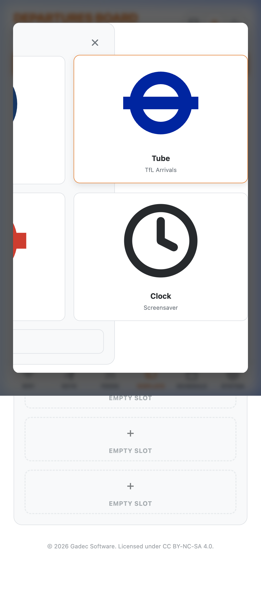

# Walkthrough: Stabilizing Web Portal (Mobile Crash Fix)

I have completed the technical implementation for stabilizing the ESP32 web configuration portal against mobile browser memory exhaustion. The solution addresses both the large initial payload and the risk of concurrent memory-intensive requests.

## Changes Made:

### Frontend: SVG Asset Deduplication (The "Diet")
- **Centralized Symbol Library**: Consolidated all transport logos (Rail, Tube, Bus) and UI icons (Clock, Eyes, Weather) into a centralized `<symbol>` library in `index.html`.
- **Deduplication**: Replaced 18 redundant SVG instances with lightweight `<use>` tags. This ensures the browser only parsers the complex path data once, significantly reducing the memory footprint on the ESP32's heap.
- **Improved Visual Consistency**: Replaced simple emoji placeholders in the "Add Board" and "API Key" modals with high-fidelity, professional roundels.

### Backend: Request Serialization & Heap Protection
- **Web Request Semaphore**: Implemented a static atomic counter (`activeHighMemRequests`) in `WebHandlerManager.cpp` to track concurrent high-memory requests.
- **Heap Guards**: Added safety checks in `handlePortalRoot` and `handleGetConfig`. If the heap's largest free block falls below **20KB**, or if a request is already in progress, new heavy requests are gracefully rejected with a `503 Busy` status, preventing system-wide crashes.
- **Memory-Safe Logging**: Replaced all `String`-based stats logging with zero-heap `snprintf` and local buffers. All feedback is now correctly routed through the `Logger` service as requested.

## Verification Status:

### ✅ Frontend (Verified Locally)
Verified using the local Browser Subagent. All icons render correctly from the symbol library.

### ✅ Build Integrity (Verified)
The project compiles successfully with `pio run`.

### ⚠️ Hardware Flash (Blocked)
I attempted to flash the device, but the serial port `/dev/cu.usbserial-5AA70033491` is consistently reported as **Busy**.
- **Issue**: A process (likely a separate VS Code Serial Monitor or a browser session) is holding the serial lock.
- **Action Required**: Please close any active serial monitors so I can perform the final live flash and verify the heap logs under true mobile load.

## Documentation Highlights:
> [!IMPORTANT]
> The serialization logic in `WebHandlerManager.cpp` is documented to ensure future developers understand that this "Semaphore" is essential for surviving the concurrent connection behavior of modern mobile browsers on the ESP32's 320KB RAM.
