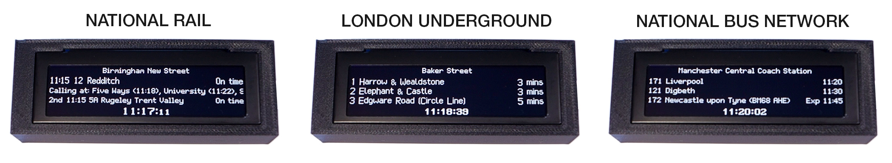

# Antigravity Departures Board 

## About the System

The **Departures Board** is an ESP32-powered IoT device designed to provide at-a-glance, real-time transport information. It drives a high-contrast OLED display to replicate the departure boards at UK railway stations, London Underground platforms, and UK bus stops.

## Getting Started

To keep the project clean, user setup has been split into three distinct stages:

- **Stage 1:** 🛠️ **[Hardware Guide (docs/Hardware.md)](docs/Hardware.md)**: Details on setting up the hardware, including the ESP32, OLED Screen SPI wiring, and 3D printing the case.
- **Stage 2:** 🚀 **[Loading Software (docs/LoadingSoftware.md)](docs/LoadingSoftware.md)**: Steps for flashing the initial firmware images via esptool or the web installer.
- **Stage 3:** ⚙️ **[Configuring the Device (docs/ConfiguringDevice.md)](docs/ConfiguringDevice.md)**: First-time WiFi access point setup, entering your API tokens, and configuring the displays and the schedules.

---

> [!NOTE]
> **Massive Credit to Gadec**  
> This project was originally conceived, designed, and developed by **[Gadec](https://github.com/gadec-uk)**. The physical case designs, the original display paradigms, and the initial inspiration for this hardware project belong entirely to their original `departures-board` repository. If you love this project, please consider supporting the original author by [buying them a coffee!](https://buymeacoffee.com/gadec.uk)

A model railway (00 gauge) version of the original project is also available [here](https://github.com/gadec-uk/tiny-departures-board).

### Why this Fork is Different

This v3.0 repository is an **Object-Oriented, agent-driven rewrite** engineered for maximum extensibility. While the underlying logic has been completely modernized, it is **fully compatible** with the original hardware: 

* **Seamless Migration**: If you want to move over from the original `gadec-uk/departures-board`, this system uses the exact same physical casing constraints and OLED SPI wiring. It will migrate existing Gadec setups.
* **More Layouts & Data**: We have introduced a fully dynamic WASM-based display simulator, expanded transit mode options, and implemented automated scrolling message pooling for diverse RSS and alert APIs.
* **Easier Configuration**: Features an ultra-lightweight, natively executed C++ web portal running securely on the ESP32. This provides an intuitive, robust interface for offline setup and transit configuration.
* **Agentic Capabilities via Antigravity:** Developed utilizing *[Antigravity](https://github.com/matthewmcneill/antigravity)* agentic capabilities, empowering LLM agents to rapidly add layouts or API integrations.

---

## Developing departures-board

Whether developing locally or iteratively using AI agents, our rigorous system architecture allows for extensive customizations. Start your journey with our Developer Guide:

- 📚 **[Developer Guide (docs/DeveloperGuide.md)](docs/DeveloperGuide.md)**: Agentic usage instructions, local build environments, and the gateway to our deep structural specifications (like the Memory Architecture and WebAssembly Simulator).

---

## Licence & Attributions

This work is licensed under **Creative Commons Attribution-NonCommercial-ShareAlike 4.0**. To view a copy of this licence, visit [https://creativecommons.org/licenses/by-nc-sa/4.0/](https://creativecommons.org/licenses/by-nc-sa/4.0/). 

> **Note:** The terms of the licence strictly prohibit commercial use of this work, which includes *any* reselling of the work in kit or assembled form for commercial gain.

### Data API Attributions
The underlying data that drives this board is provided freely via APIs by UK transit authorities. We strictly adhere to their accreditation requirements:
- Powered by National Rail Enquiries (OpenLDBWS Lite).
- Powered by TfL Open Data. Contains OS data © Crown copyright and database rights 2016 and Geomni UK Map data © and database rights [2019].
- UK Bus data provided by `bustimes.org` API.
