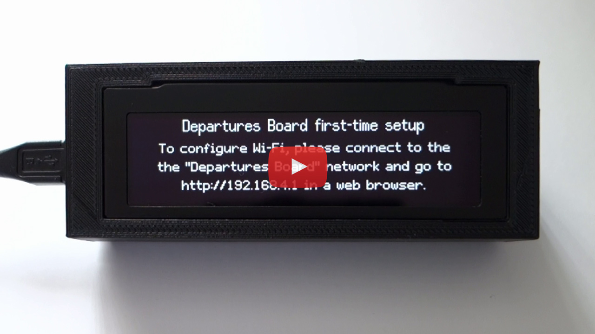

# Configuring the Device

This guide covers everything you need to know about navigating the web configuration interface, enabling API keys, and setting up the display logic.

## First Time Configuration

WiFiManager is used to set up the initial WiFi connection on first boot. 
1. The ESP32 will broadcast a temporary WiFi network named **"Departures Board"**.
2. Connect to the network and follow the on-screen instructions.
3. You can watch a video walkthrough of the setup and configuration process below:

Once the ESP32 has established an internet connection, the next step is to enter your API keys. Select a station location by typing the location name, and valid choices will be displayed as you type. *(Note: If you do not enter a National Rail token, the board will only operate in Tube and Bus modes).*

---

## Web GUI

At start-up, the ESP32's IP address is displayed. To change the station or to configure other miscellaneous settings, open the web page at that address. 

### Basic Settings
- **Board Mode** - Switch between National Rail Departures, London Underground Arrivals, or UK Bus Stops modes.
- **Station** - Select a National Rail station from the drop-down.
- **Underground Station** - Select an Underground or DLR station.
- **Bus Stop ATCO code** - Monitor a specific bus stop (see [Bus Stop ATCO codes](#bus-stop-atco-codes)).
- **Brightness** - Adjusts the OLED screen brightness.
- **Show the date on screen** - Displays the date in the upper-right corner.

### Filtering (Rail)
- **Only show services calling at** - Filter services to only show trains going *to* a specific station.
- **Only show these platforms** - Filter services based on departure platform.
- **Alternate station** - Automatically switch to an alternate station during specific hours.

### Advanced Options (*)
- **Include bus replacement services** - Show a bus icon in place of the platform number.
- **Include current weather at station location** - Requires valid OpenWeather Map API key.
- **Enable daily check for firmware updates** - Check for automatic updates just after midnight.
- **Enable overnight sleep mode (screensaver)** - Turn off display overnight to prevent burn-in.
- **Flip the display 180°** - Rotates the display to fit different case angles.
- **Custom (non-UK) time zone** - Set the clock to display local time (see [Custom Time Zones](#custom-time-zones)).
- **Display RSS news headlines feed** - Display top headlines from selected feeds after service messages.

### System Actions Dropdown
A drop-down menu (top-right) adds the following options:
- **Check for Updates** - Manually check for updates.
- **Edit API Keys** - View/edit API keys.
- **Clear WiFi Settings** - Deletes the stored WiFi credentials and reboots in setup mode.
- **Restart System** - Reboots the ESP32.

### Other Web GUI Endpoints
- `/factoryreset` - Factory reset erasing all configuration and WiFi credentials.
- `/update` - Manual OTA firmware updates via file upload. (Use `firmware.bin` only).
- `/info` - Diagnostics info.
- `/formatffs` - Formats the file system (keeps WiFi).
- `/dir` and `/upload` - Advanced filesystem utilities.
- `/control` - Endpoint for automation. E.g., `/control?sleep=1&clock=0` forces sleep mode.

---

## Bus Stop ATCO codes
Every UK bus stop has a unique ATCO code number. To find the ATCO code you want:
1. Go to [bustimes.org/search](https://bustimes.org/search).
2. Type a location in the search box and select the specific stop.
3. The ATCO code is shown on the stop information page.
4. Enter the code in the settings screen and tap **Verify**.

---

## Custom Time Zones
To set a custom time zone for the clock display, enter the POSIX time zone string for your location. 
* Examples: `CST6CDT,M3.2.0/2,M11.1.0/2` (Canada Central) and `AEST-10AEDT,M10.1.0,M4.1.0/3` (Australia Eastern). 
* Ask any AI chat engine: *"What is the POSIX time zone string for ..."* if unsure.
*(Note: Service times are always shown in UK time, only the clock is affected).*
